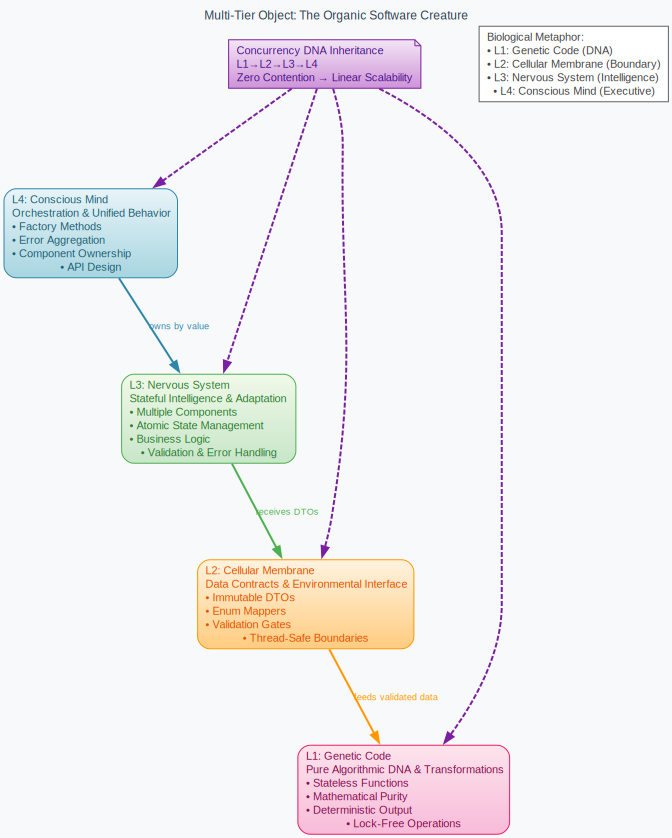

# Multi-Tier Object Architecture: Graphviz Diagrams

## 🧬 **Biological Software Creatures - Interactive Visual Architecture**

This directory contains the complete visual documentation for the **Multi-Tier Object Architecture** using **Graphviz DOT files** that create sophisticated, biologically-inspired diagrams.

## 📊 **Available Diagrams**

### 1. `biological_creature_architecture.dot`
**Complete 4-Layer Creature Overview**
```bash
# Generate PNG
dot -Tpng biological_creature_architecture.dot -o creature_architecture.png

# Generate SVG (recommended for web/docs)
dot -Tsvg biological_creature_architecture.dot -o creature_architecture.svg

# Generate PDF
dot -Tpdf biological_creature_architecture.dot -o creature_architecture.pdf
```

**Features:**
- Biological color theming (Genetic DNA, Cellular Membrane, Nervous System, Conscious Mind)
- Concurrency DNA inheritance visualization
- Layer relationship flows with proper ownership semantics
- Interactive tooltips and navigation

### 2. `l2_validation_flow.dot`
**L2 Cellular Membrane Validation Pipeline**
```bash
# Generate high-resolution PNG
dot -Tpng -Gdpi=300 l2_validation_flow.dot -o l2_validation_flow.png

# Generate interactive SVG
dot -Tsvg l2_validation_flow.dot -o l2_validation_flow.svg
```

**Features:**
- Step-by-step validation flow with embedded rule annotations
- `[Rule: Must be const after init]` checkpoints
- Error flow visualization (dashed red lines)
- Pre-execution validation gates
- "Feed validated & thread-safe values" pattern

### 3. `l3_nervous_system.dot`
**L3 Multi-Component Neural Architecture**
```bash
# Generate neural network visualization
dot -Tpng l3_nervous_system.dot -o l3_nervous_system.png

# Generate scalable vector graphics
dot -Tsvg l3_nervous_system.dot -o l3_nervous_system.svg
```

**Features:**
- Biological neural network theming
- Independent neural centers (Cognitive, Behavioral, Adaptive)
- Component-specific validators and error handlers
- Neural coordination framework
- L1 Genetic Code integration

### 4. `l4_orchestration.dot`
**L4 Conscious Mind Orchestration**
```bash
# Generate orchestration flow diagram
dot -Tpng l4_orchestration.dot -o l4_orchestration.png

# Generate comprehensive SVG
dot -Tsvg l4_orchestration.dot -o l4_orchestration.svg
```

**Features:**
- Factory method visualization (Minimal/Adaptive organisms)
- Component ownership by value
- Error aggregation and coordination
- API flow through validation gates
- Thread-local coordination patterns

## 🛠️ **Installation & Usage**

### **Prerequisites**
```bash
# Ubuntu/Debian
sudo apt-get install graphviz

# macOS
brew install graphviz

# Windows (Chocolatey)
choco install graphviz

# Or download from: https://graphviz.org/download/
```

### **Quick Start**
```bash
# Generate all diagrams at once
for file in *.dot; do
    base=$(basename "$file" .dot)
    dot -Tsvg "$file" -o "${base}.svg"
    dot -Tpng "$file" -o "${base}.png"
done

# View in browser (Linux/Mac)
xdg-open biological_creature_architecture.svg

# View in browser (Windows)
start biological_creature_architecture.svg
```

### **High-Quality Output**
```bash
# Generate publication-quality PDFs
dot -Tpdf -Gdpi=600 biological_creature_architecture.dot -o architecture.pdf

# Generate large PNGs for presentations
dot -Tpng -Gsize=2048,2048 biological_creature_architecture.dot -o large_architecture.png
```

## 🎨 **Biological Color Scheme**

| **Layer** | **Color** | **Hex Code** | **Biological Meaning** |
|-----------|-----------|--------------|------------------------|
| **L1 Genetic Code** | Pink | `#fce4ec` | DNA, cellular reproduction |
| **L2 Cellular Membrane** | Orange | `#fff3e0` | Cell membrane, selective permeability |
| **L3 Nervous System** | Green | `#e8f5e8` | Neural tissue, synaptic transmission |
| **L4 Conscious Mind** | Blue | `#e8f4f8` | Cerebral cortex, executive function |
| **Concurrency DNA** | Purple | `#f3e5f5` | Genetic inheritance, mitochondrial DNA |
| **Validation Rules** | Red | `#ffebee` | Immune response, error detection |
| **Factory Methods** | Light Blue | `#e1f5fe` | Cellular differentiation, specialization |

## 🔧 **Customization**

### **Modify Colors**
```dot
// Change L1 color to different pink
L1 [fillcolor="#f8bbd9:#f48fb1"]

// Change L4 to different blue
L4 [fillcolor="#bbdefb:#90caf9"]
```

### **Adjust Layout**
```dot
// Make diagram wider
graph [nodesep="1.0" ranksep="1.5"]

// Change orientation
graph [rankdir="LR"]  // Left to right instead of top to bottom
```

### **Add Custom Elements**
```dot
// Add custom validation checkpoint
custom_checkpoint [label="[Rule: Your Custom Rule]\lSpecific validation logic\lError handling"
                  fillcolor="#fff3e0"
                  color="#f57c00"
                  fontcolor="#e65100"];
```

## 📚 **Integration with Documentation**

### **Markdown Integration**
```markdown
## Architecture Overview



*See: `biological_creature_architecture.dot` for source*

This interactive Graphviz diagram shows the complete Multi-Tier Object architecture...
```

### **LaTeX Integration**
```latex
\begin{figure}[H]
\centering
\includegraphics[width=\textwidth]{biological_creature_architecture.pdf}
\caption{Multi-Tier Object Architecture: Biological Software Creatures}
\label{fig:creature_architecture}
\end{figure}
```

### **Web Documentation**
```html
<figure>
    
    <figcaption>
        Interactive Graphviz diagram showing the complete 4-layer biological architecture.
        <a href="biological_creature_architecture.dot">View source</a>
    </figcaption>
</figure>
```

## 🎯 **Advanced Features**

### **Interactive SVG Features**
- **Hover tooltips** showing detailed layer information
- **Clickable elements** for navigation
- **Responsive scaling** for different screen sizes
- **Searchable text** for documentation integration

### **Static Analyzer Integration**
- **Rule annotations** embedded in diagram nodes
- **Validation checkpoints** with specific enforcement
- **Error flow visualization** with failure paths
- **Pre-execution gates** showing validation requirements

### **Biological Metaphor Enhancement**
- **DNA inheritance patterns** showing concurrency flow
- **Neural network visualization** for L3 components
- **Cellular membrane permeability** for L2 boundaries
- **Conscious orchestration** for L4 coordination

## 🚀 **Best Practices**

### **Diagram Maintenance**
1. **Keep diagrams in sync** with code changes
2. **Use consistent color schemes** across all diagrams
3. **Update rule annotations** when validation logic changes
4. **Regenerate outputs** after any DOT file modifications

### **Documentation Integration**
1. **Reference DOT files** in whitepapers and READMEs
2. **Include generation commands** for reproducibility
3. **Provide multiple formats** (SVG, PNG, PDF)
4. **Link to interactive versions** in web documentation

### **Presentation Usage**
1. **Use SVG for web presentations** (scalable, interactive)
2. **Use PDF for print materials** (high quality, consistent)
3. **Use PNG for slides** (reliable rendering)
4. **Generate at high DPI** for professional presentations

## 📖 **Further Reading**

- **WhitePaper.md**: Complete theoretical foundation
- **StaticAnalyzer/**: Implementation of validation rules
- **CodeGeneration/**: Template-based creature generation
- **Testing/**: Property-based testing contracts

---

## 🎨 **The Result: Professional Biological Architecture Visualization**

**These Graphviz diagrams transform primitive ASCII art into:**

✅ **Professional Visual Documentation** - Publication-quality diagrams
✅ **Interactive Biological Metaphor** - Living color schemes and neural theming
✅ **Embedded Rule Enforcement** - Validation checkpoints integrated into flow
✅ **Multi-Format Output** - SVG, PNG, PDF for different use cases
✅ **Scalable Architecture** - Easy to modify and extend
✅ **Documentation Integration** - Seamless inclusion in papers and presentations

**The Multi-Tier Object Architecture now has world-class visual documentation that rivals academic publications! 🧬📊🎯✨**
