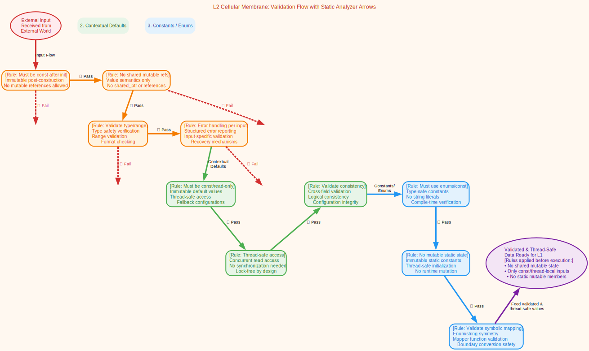
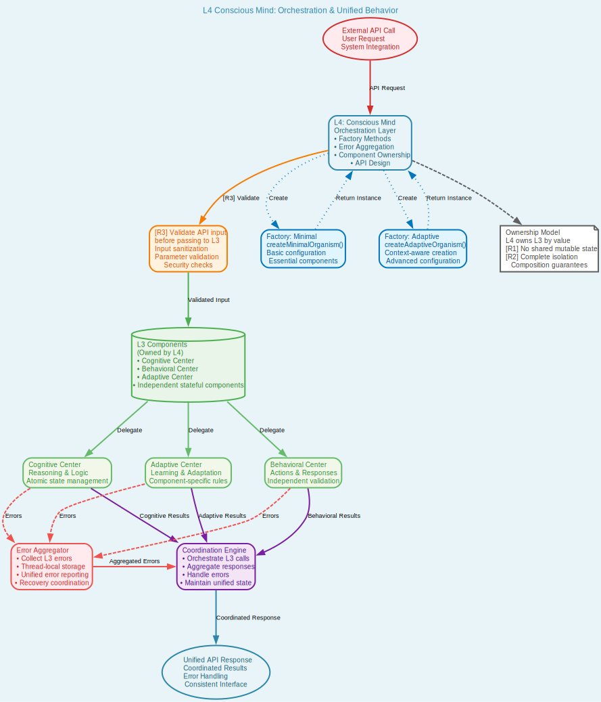

# The Organic Software Creature: A Universal Meta-Pattern Framework

This repository contains the reference implementation and documentation for **The Organic Software Creature**, a universal meta-pattern for software architecture. It provides a framework for designing individual software objects as complete, self-contained "creatures" with a robust internal, four-layer biological structure.

## Table of Contents

- [The Organic Software Creature: A Universal Meta-Pattern Framework](#the-organic-software-creature-a-universal-meta-pattern-framework)
  - [Table of Contents](#table-of-contents)
  - [Abstract: The "Why"](#abstract-the-why)
  - [The Core Concept: The Four Layers of a Software Creature](#the-core-concept-the-four-layers-of-a-software-creature)
    - [🧬 L1: Genetic Code (Pure Algorithmic DNA)](#-l1-genetic-code-pure-algorithmic-dna)
    - [🛡️ L2: Cellular Membrane (Immutable Data Contracts)](#️-l2-cellular-membrane-immutable-data-contracts)
    - [🧠 L3: Nervous System (Stateful Intelligence)](#-l3-nervous-system-stateful-intelligence)
    - [👁️ L4: Conscious Mind (Orchestration \& Unified Behavior)](#️-l4-conscious-mind-orchestration--unified-behavior)
  - [Visualizing the Architecture](#visualizing-the-architecture)
  - [The Framework: From Theory to Reality](#the-framework-from-theory-to-reality)
    - [Getting Started (The Vision)](#getting-started-the-vision)
  - [Project Roadmap](#project-roadmap)
  - [How to Contribute](#how-to-contribute)
  - [License](#license)

### Abstract: The "Why"

While software engineering has excelled at defining relationships *between* objects (e.g., Factory, Observer, Strategy), it has largely neglected the internal architecture of the objects themselves. This meta-pattern addresses that gap.

The core idea is to treat every significant software object as a complete organism with specialized, interdependent internal systems. This approach ensures that objects are born with inherent qualities like purity, resilience, and testability, making them naturally adaptable to any higher-level design pattern.

---

## The Core Concept: The Four Layers of a Software Creature

This pattern mandates a four-layer architecture, where each layer has a distinct biological role and responsibility. The layers are interconnected through mandatory, verifiable contracts, ensuring the creature's integrity.

---

### 🧬 L1: Genetic Code (Pure Algorithmic DNA)
The immutable, stateless, and mathematically pure foundation. This layer contains the creature's core algorithms as pure, deterministic functions with no side effects. It is the creature's unchangeable DNA.

### 🛡️ L2: Cellular Membrane (Immutable Data Contracts)
The protective boundary that interfaces with the outside world. This layer defines all data contracts (DTOs) and validation rules as immutable structures, ensuring that only clean, validated data can enter the creature's internal systems.

### 🧠 L3: Nervous System (Stateful Intelligence)
The adaptive core that manages state and business logic. This layer is composed of independent, stateful components that use atomic operations for concurrency. It is where the creature's "intelligence" and learned behavior reside.

### 👁️ L4: Conscious Mind (Orchestration & Unified Behavior)
The executive function that owns and coordinates the other layers. This layer provides the creature's public interface, orchestrating the internal systems to produce coherent behavior and managing the creature's lifecycle.

---

## Visualizing the Architecture

The relationships and flows between the layers are critical to the pattern. These diagrams visualize the specific architecture of each of the core layers.

| L2 Validation Flow | L3 Nervous System | L4 Orchestration |
| :---: | :---: | :---: |
| *The L2 validation pipeline, ensuring data integrity.* | *The L3 multi-component neural architecture.* | *The L4's ownership and orchestration model.* |
|  |  |  |

---

## The Framework: From Theory to Reality

This repository is more than a whitepaper—it's a working framework to bring the theory to life. It provides the tooling to build, validate, and test your own software creatures.

*   **Code Generator:** Turns simple YAML schemas into full, four-layered C++ code.
*   **Static Analyzer:** Enforces the architectural rules and contracts of the meta-pattern.
*   **Build & Test Integration:** Designed to work with standard tools like CMake and Google Test to ensure every creature is born viable and robust.

### Getting Started (The Vision)

The goal is a simple, powerful workflow:
1.  **Define** your creature's properties in a `schema.yml` file.
2.  **Generate** the complete C++ source code using the framework's CLI: `osc-cli generate --schema <path>`.
3.  **Build** your creature using the integrated CMake build system.
4.  **Test** your creature's functionality and architectural integrity using the automatically generated test suite.

### Project Roadmap

This project is currently in the foundational scaffolding phase. For a detailed plan of upcoming features and the path to a production-ready version, please see the **[Framework Roadmap](./Documentation/ROADMAP.md)**.

### How to Contribute

Contributions are welcome! Please feel free to submit a pull request or open an issue.

### License

This project is licensed under the MIT License. See the [LICENSE](LICENSE) file for details.